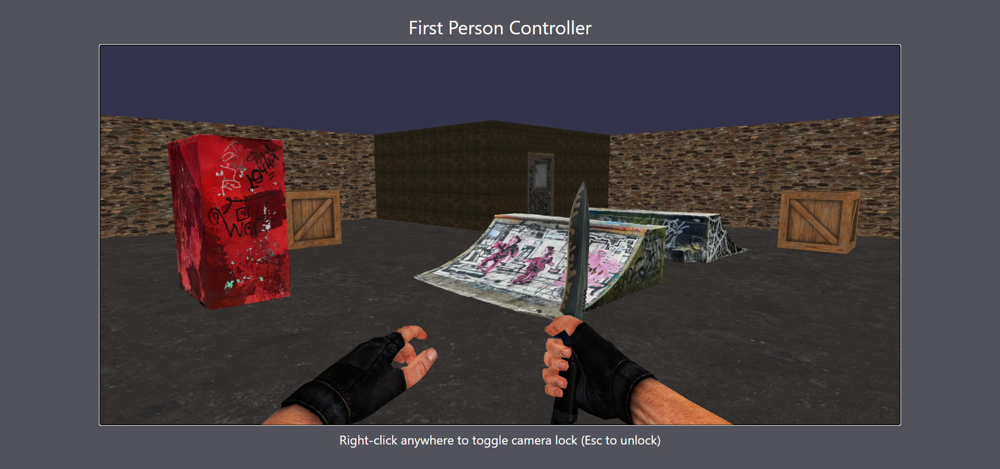
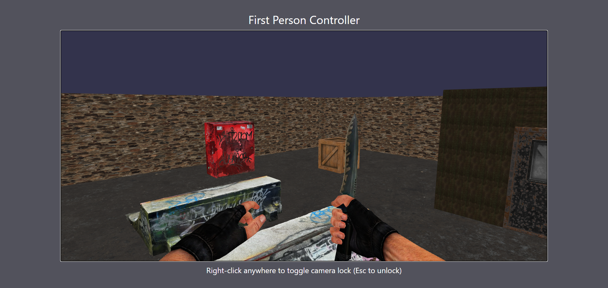
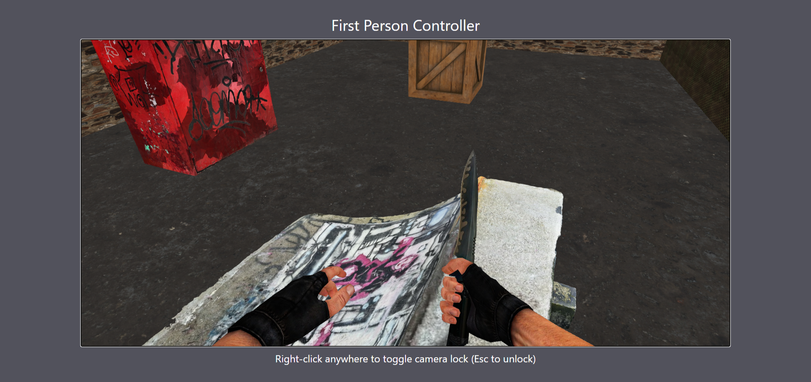

# 🕹️ First Person Controller — Babylon.js + React + TypeScript

> 🟢 **Live Demo:** [https://fpscontroller.netlify.app](https://fpscontroller.netlify.app)

A small learning project built with **Babylon.js** and **React (TypeScript)** that demonstrates  
how to create a **first-person 3D environment** with collisions, jumping, and interactive rooms.

## 🧭 Overview

This project was created as part of my exploration into **3D graphics and interaction systems** in the browser.  
It focuses on building a **first-person movement system** from scratch using Babylon.js physics and camera controls.

### 🎯 Core Learning Goals

- Understanding Babylon.js **scene creation, camera control, and lighting**
- Implementing **FPS movement with gravity, collisions, and jumping**
- Structuring a **React + Babylon.js integration**
- Creating and texturing 3D environments (room, walls, floor, props)

## ✨ Features

- 🧍 **First-Person Camera** with pointer lock and WASD movement
- ⚙️ **Gravity and Jumping Physics** using Babylon’s collision system
- 🧱 **3D Environment** built from planes and meshes (room, walls, objects)
- 💎 **PBR Materials** with realistic textures (concrete, metal, etc.)
- 🔁 **Responsive Scene** that auto-resizes with window changes
- 🎮 **Pointer Lock Mode** (Right-click to lock/unlock camera view)

## 🛠️ Tech Stack

| Category        | Tools                             |
| --------------- | --------------------------------- |
| 3D Engine       | Babylon.js Core                   |
| Framework       | React + TypeScript                |
| Build Tool      | Vite                              |
| Styling         | Tailwind CSS                      |
| Models & Assets | Custom textured planes and meshes |

## 🚀 Getting Started

### 1️⃣ Clone the Repository

```bash
git clone https://github.com/dilangezgin/first-person-controller.git
cd first-person-controller
```

### 2️⃣ Install Dependencies

```bash
npm install
```

### 3️⃣ Run in Development Mode

```bash
npm run dev
```

Open [http://localhost:5173](http://localhost:5173) in your browser.
Right-click to toggle pointer lock and use **WASD** + **Space** to move.

### 4️⃣ Build for Production

```bash
npm run build
```

## 📂 Folder Structure

```
📦 first-person-controller
 ┣ 📂 public
 ┃ ┣ 📂 image
 ┃ ┃ ┗ arm_knife.png
 ┃ ┣ 📂 model
 ┃ ┃ ┣ door.glb
 ┃ ┃ ┣ electric_box.glb
 ┃ ┃ ┣ skate_ramp.glb
 ┃ ┃ ┗ wood_box.glb
 ┃ ┣ 📂 texture
 ┃ ┃ ┣ 📂 ground
 ┃ ┃ ┣ 📂 room-wall
 ┃ ┃ ┗ 📂 wall
 ┃ ┗ 🗎 vite.svg
 ┣ 📂 src
 ┃ ┣ 📂 components
 ┃ ┃ ┣ CreateObjects.ts
 ┃ ┃ ┣ CreateRoom.ts
 ┃ ┃ ┗ CreateWalls.ts
 ┃ ┣ 📂 Scene
 ┃ ┃ ┗ BabylonScene.tsx
 ┃ ┣ 🗎 App.tsx
 ┃ ┣ 🗎 main.tsx
 ┃ ┗ 🗎 index.css
 ┣ 🗎 vite.config.ts
 ┣ 🗎 tsconfig.json
 ┣ 🗎 package.json
 ┗ 🗎 README.md

```

## 🎮 Controls

| Action              | Key         |
| ------------------- | ----------- |
| Move Forward        | W           |
| Move Backward       | S           |
| Move Left           | A           |
| Move Right          | D           |
| Jump                | Space       |
| Pointer Lock Toggle | Right Click |
| Unlock Pointer      | Esc         |

## 🖼️ Screenshots





## 🧠 What I Learned

- How Babylon.js handles **collisions, gravity, and movement vectors**
- Integrating a **3D engine inside a React lifecycle**
- Creating **PBR materials** for realistic surfaces
- Structuring reusable environment logic (`CreateWalls`, `CreateRoom`, `CreateObjects`)
- Handling **pointer lock states** cleanly with React hooks

## 💡 Future Improvements

- 🚪 **Door Interaction** — implement interactive doors that open and close when the player gets close or presses a key
- ⏳ **Custom Loading Screen** — add a smooth loading interface with a progress bar for model and texture loading
- 🔊 **Sound Design** — introduce background ambience, footstep, and door-opening sounds for immersive realism
- 🔫 **Firing Feature** — add basic shooting mechanics with projectile effects and impact detection

## 👨‍💻 Author

**Tunahan Demirel**

💻 Front-End Developer | Exploring Babylon.js

## 🪪 License

This project is licensed under the **MIT License** — feel free to explore and remix it for learning.
